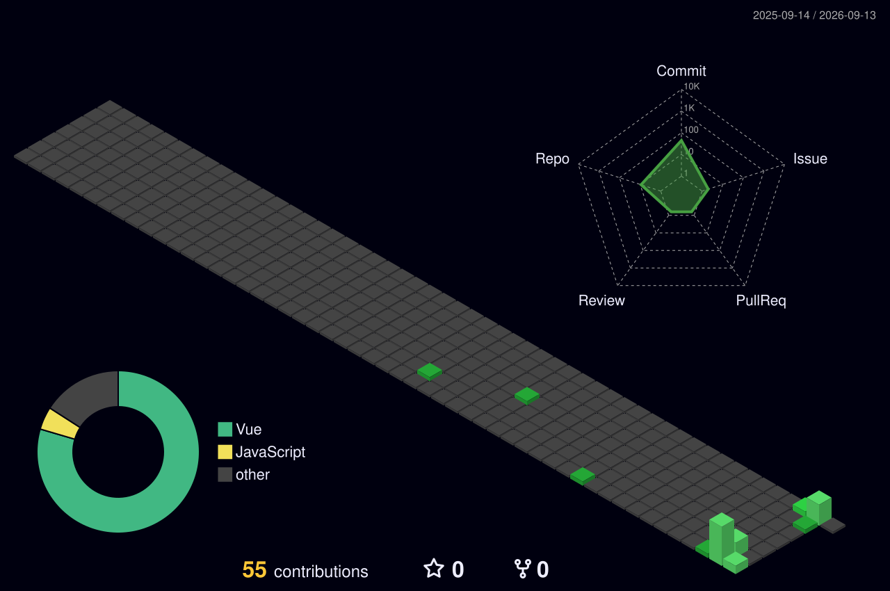

## 你好 👋

我是 MFCompany，一个初中在读学生，我平时喜欢搭建一些网站，制作一些App

## 总览

## 项目

我创建的/我主要参与的项目：

## 开发
- 我主要使用的编程语言： 
  
  
  
  
  

- 我主要使用的框架： 
  
- 我主要使用的开发工具： 
  
  
  

## 与我联系

- 电子邮件（MFCO）：<mfco@mail.mfco.top>
 
<!--
**MFCompany/MFCompany** is a ✨ _special_ ✨ repository because its `README.md` (this file) appears on your GitHub profile.

Here are some ideas to get you started:

- 🔭 I’m currently working on ...
- 🌱 I’m currently learning ...
- 👯 I’m looking to collaborate on ...
- 🤔 I’m looking for help with ...
- 💬 Ask me about ...
- 📫 How to reach me: ...
- 😄 Pronouns: ...
- ⚡ Fun fact: ...
-->
